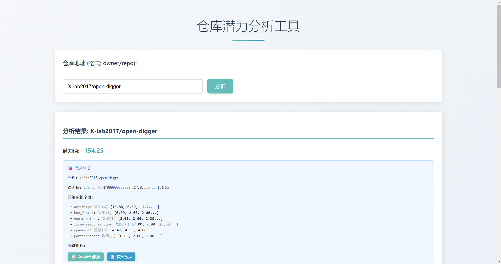
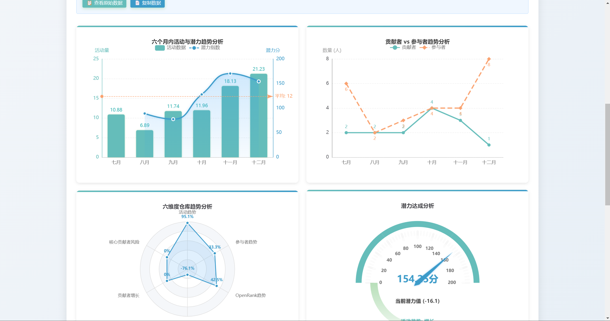
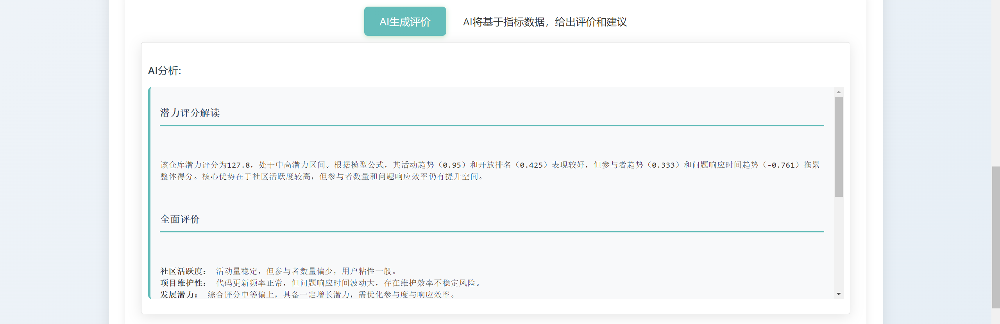
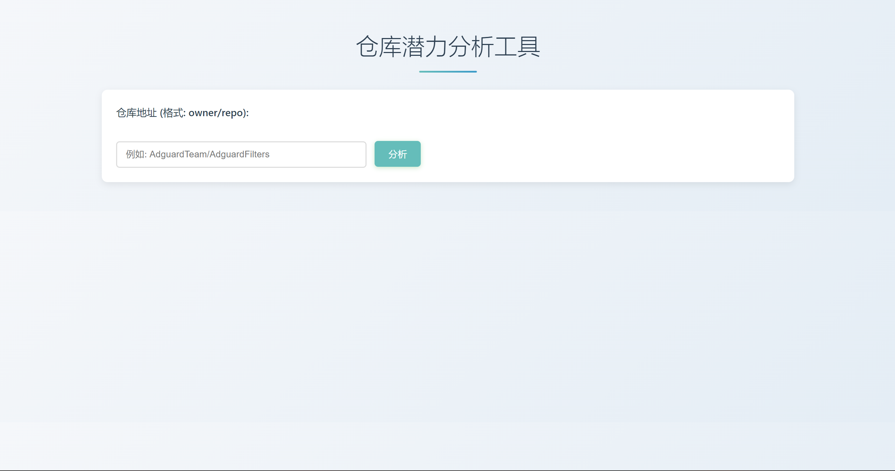

# potential-radar
## 一、作品简介
基于opendigger指标和线性回归的github仓库潜力评估模型，结合AI评价和建议生成和可视化报告。

## 二、功能介绍
用户输入github仓库地址，便能生成潜力值评估报告：


可视化报告
- 活跃度和潜力值的复合图像
- 贡献者和参与者的趋势折线图
- 六维度趋势雷达图
- 潜力值仪表盘



ai生成评价和建议（接入qwen-turbo模型）


## 三、技术栈
1. **开发语言**：Python 3.9、JavaScript
2. **核心框架/库**：
   - Flask（Python Web框架）
   - ECharts 5.x（数据可视化）
   - Requests（Python网络请求）、Urllib（Python网络请求）
   - Marked.js/Showdown.js（网页Markdown渲染）
3. **数据工具/接口**：
   - OpenDigger（开源数据分析工具）
   - GitHub API（开放数据接口）
   - Qwen-turbo API（大模型服务接口）

## 四、快速开始
将仓库克隆到本地。安装依赖
```
pip install flask, lask_cors, openai
```
进入backend文件夹,运行后端文件启动服务器。
```
cd ./backend
python app.py
```
用浏览器打开`frontend/index.html`即可。
